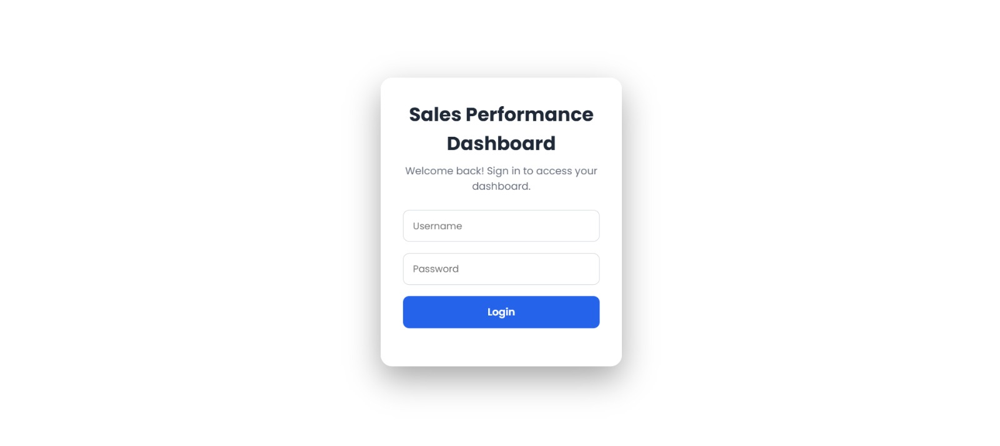
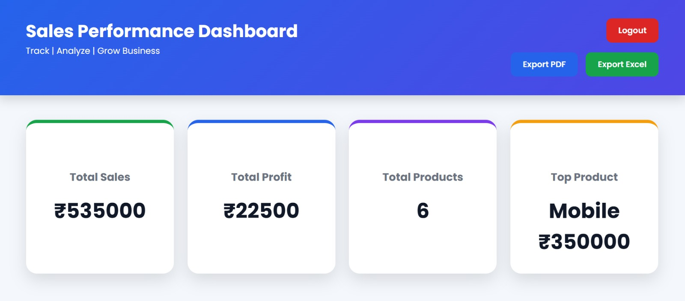
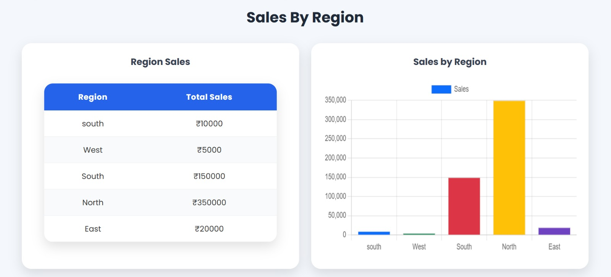
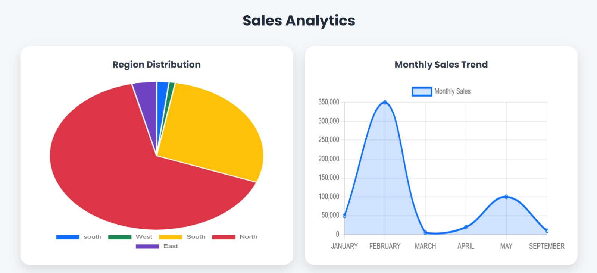
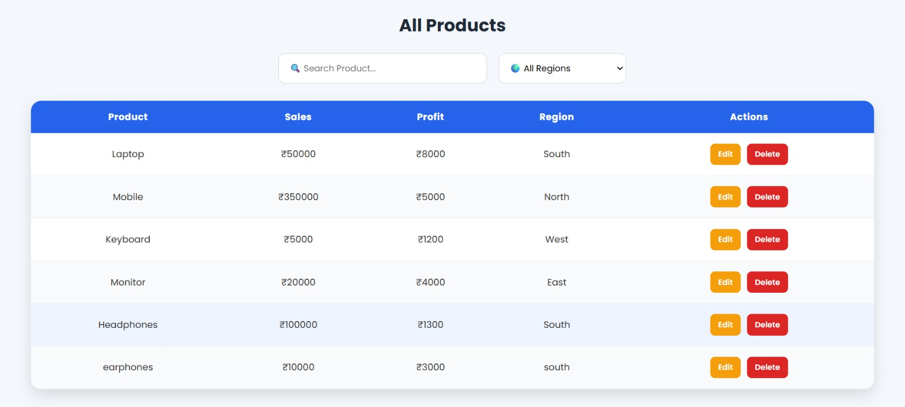
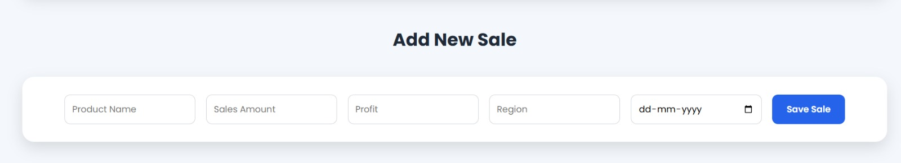

# 📊 Sales Performance Dashboard

A modern Full-Stack Sales Performance Dashboard built using **Spring Boot**, **MySQL**, **HTML**, **CSS**, **JavaScript**, and **Chart.js**. The application helps businesses monitor sales performance, visualize analytics, and manage sales records efficiently through an interactive dashboard.

---

## 🚀 Features

- 🔐 Secure Login Page
- 📈 Dashboard displaying:
  - Total Sales
  - Total Profit
  - Total Products
  - Top Selling Product
- 📊 Sales by Region (Bar Chart)
- 🥧 Region Distribution (Pie Chart)
- 📅 Monthly Sales Trend
- 🔍 Search Products
- 🌍 Filter Products by Region
- ➕ Add New Sales Record
- ✏️ Update Existing Sales
- 🗑️ Delete Sales Record
- 📄 Export Dashboard as PDF
- 📊 Export Data to Excel
- 🎨 Responsive and Professional User Interface

---

## 🛠️ Tech Stack

### Backend
- Java 17
- Spring Boot
- Spring Data JPA
- Hibernate
- MySQL

### Frontend
- HTML5
- CSS3
- JavaScript
- Chart.js

### Tools
- Eclipse IDE
- Maven
- Git
- GitHub

---

 ## 📸 Application Screenshots

### 🔐 Login Page



---

### 📊 Dashboard Overview



---

### 📈 Sales by Region (Bar Chart)



---

### 🥧 Region Distribution (Pie Chart)



---

### 🔍 Search & Filter Products



---

### ✏️ Update Sales Record


## 📂 Project Structure

```
Sales-Performance-Dashboard
│
├── src
│   ├── main
│   │   ├── java
│   │   ├── resources
│   │   │   ├── static
│   │   │   ├── templates
│   │   │   └── application.properties
│
├── screenshots
│
├── pom.xml
├── README.md
└── mvnw
```

---

## ⚙️ Installation

### Clone the repository

```bash
git clone https://github.com/hemaharshini-DA/Sales-Performance-Dashboard.git
```

### Open the project

Import the project into Eclipse or IntelliJ IDEA as a Maven project.

### Configure MySQL

Update the database configuration in:

```
src/main/resources/application.properties
```

Example:

```properties
spring.datasource.url=jdbc:mysql://localhost:3306/salesdashboard
spring.datasource.username=root
spring.datasource.password=yourpassword
```

### Run the application

Run:

```
SalesdashboardApplication.java
```

Open your browser:

```
http://localhost:8080/login.html
```

---

## 📈 Future Improvements

- Role-based authentication
- Sales forecasting using Machine Learning
- Email reports
- Dark mode
- Cloud deployment
- User management
- Mobile responsive enhancements

---

## 🎯 Learning Outcomes

This project helped me learn:

- Spring Boot REST APIs
- CRUD Operations
- MySQL Database Integration
- JPA & Hibernate
- Frontend Development using HTML, CSS & JavaScript
- Data Visualization using Chart.js
- PDF & Excel Export
- Git & GitHub Version Control

---

## 👩‍💻 Author

**Hema Harshini**

GitHub:
https://github.com/hemaharshini-DA

---

## ⭐ Support

If you like this project, consider giving it a ⭐ on GitHub!
